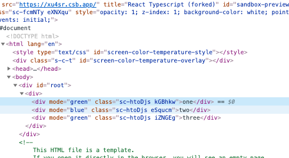

# Todo

- check if JSX.Elmeent is assignable to ReactNode. 
- Check stuff about 'Function of a certain type'. 


# TypeScript and React

Typings for React can be added by install `yarn add -D @types/react`. 

There are a lot of typings for React. 

In this lesson we will go over the ones you may need to use the most. 

Remember though - by allowing TypeScript to infer types, you often don't need to explicitly state the types!

The reality is - there are probably only three React types you actually need to know - `React.ReactElement`, `React.ReactNode`  and `React.ComponentType`. 

## Before we start - let's talk about React and JSX. 

React introduces this new syntax called JSX, which we're all familiar with. But it's probably important to understand what it actually is. 

When we declare a function component: 

```typescript
const MyComponent = ({name}) => {
    return <div> hello {name} </div>; 
}
```

The component declaration is just a straight up function. 

When we type the `<div> hello {name}</div>` - this is just syntatic shorthand for writing: 

```typescript
React.createElement("div", null,
        "hello ",
        name);
```

If we use the above component in another component like: 

`<MyComponent name ="foo"/>` then similarly the actual code is just: 

```typescript 
const OtherComponent = () => {
    return React.createElement(MyComponent, { name: "foo" });
};
```

Now when we execute this code, what we get is:

```
console.log(<MyComponent name ="foo"/>); 
console.log(<OtherComponent/>); 
```

```
{ '$$typeof': Symbol(react.element),
  type: [Function: MyComponent],
  key: null,
  ref: null,
  props: { name: 'foo' },
  _owner: null,
  _store: {} }
{ '$$typeof': Symbol(react.element),
  type: [Function: OtherComponent],
  key: null,
  ref: null,
  props: {},
  _owner: null,
  _store: {} }
```


It is these objects that ultimately go to the React engine and determines what gets displayed on the screen. 

So what I want to highlight here is that when we talk about _components_, we are talking about functions (or the React.Component class) that return JSX. When we talk about _JSX_ or _rendered JSX_ we are talking about that object. 

### Exercise 

Look at the code in `src/render.tsx`. 

Now run `yarn build:render`. 

Look at the compiled code in `lib/render.js`

Now run `yarn start:render`

Examine the output. 
## ReactElement vs ReactNode vs JSX.Element

These types are the return value of a function component, or a class component's `render` function. 

I _highly recommend reading this thread_: https://stackoverflow.com/questions/58123398/when-to-use-jsx-element-vs-reactnode-vs-reactelement

A `ReactElement` is specifically a 'reacty' JSX object, it basically looks like this: 

```
{ '$$typeof': Symbol(react.element),
  type: 'div',
  key: null,
  ref: null,
  props: { children: 'hello' },
  _owner: null,
  _store: {} }
```

It does not include strings, nulls etc. 

It has two generic parameters `P` for it's props, and `T` for.... I'm not sure what? It says' `type` but I'm not sure what that refers to. 

A `JSX.Element` is a ReactElement with the generic parameters set as `any`. Note that the `React.ReactElement` has its default generic parameters set to `any`-ish anyway. 

A `ReactNode` is this, and also other valid JSX expressions - such as a ReactFragment, a string, a number or an array of ReactNodes, or null, or undefined, or a boolean.

**Take home point**: `ReactElement` and `ReactNode` are specifically the 'reacty' object - whereas ReactNode is that + primitives like string, number, fragment, null etc. 

## React.ComponentClass vs React.FunctionComponent vs React.ComponentType

`React.ComponentType` is the easiest to understand, it's just `React.ComponentClass | React.FunctionComponent`. 

These types are essentially *functions* that create the component *instances* themselves. 

But there is an important distinction: 

A Function component accepts props only and directly returns JSX. 

A Class component is first instantiated, and then returns JSX via it's render method.

Now there is one _very important_ (and annoying) distinction. 

A `React.FunctionComponent` must return rendered JSX (more on this later), strings, numbers etc, are not a valid return type for a `React.FunctionComponent`. For a `React.ComponentClass` the `render` method can return strings, numbers etc. 


See debug2.tsx 

```typescript
import React from "react"; 

type User = {
    id: string; 
    name: string; 
    imgSrc: string; 
}

type UserPanelProps = {
    user: User; 
}

export const UserPanel1 = (props: UserPanelProps) => {
    return <div> 
        {props.user.name}
    </div> 
}

export const UserPanel2 = (props: UserPanelProps) => {
    return props.user.name;
}

export const UserPanel3 = (props: UserPanelProps) => {
    return <>props.user.name</>
}


export const UserPanel4 = (props: UserPanelProps) => {
    return null;
}


class UserPanel5 extends React.Component<UserPanelProps> {
    render() {
        return this.props.user.name; 
    }
}

const Main = () => {
    const user = {
        id: "1", 
        name: "Foo bar", 
        imgSrc: ""
    }
    return <div> 
        <UserPanel1 user = {user}/>
        {/*   
            'UserPanel2' cannot be used as a JSX component.
            Its return type 'string' is not a valid JSX element.ts(2786)
         */}
        <UserPanel2 user = {user}/>
        <UserPanel3 user = {user}/>
        {UserPanel2({user})}

        <UserPanel4 user = {user}/>

        <UserPanel5 user = {user}/>


    </div>
}
```

To be clear about what we mean here - take four kinds of 'UserPanel' components: 

```typescript

// Class component
type User = {
    name: string; 
    id: string; 
    imgSrc: string; 
}


// Class component
class ClassBasedUserPanel extends React.Component<{user: User}> {
    render() {
        return <div>{this.props.user.name}</div>; 
    }
}

// Class component that returns a string
class ClassBasedUserPanelThatReturnsString extends React.Component<{user: User}>  {
    render() {
        return this.props.user.name;
    }; 
}


// Function component
const FunctionBasedUserPanel = (props: {user: User})=> {
    return <div>{props.user.name} </div>; 
}

// Function component that returns a string
const FunctionBasedUserPanelThatReturnsString = (props: {user: User})=> {
    return props.user.name; 
};


// Directly referencing the component itself

// TypeScript is not being very helpful here!
const a = ClassBasedUserPanel;  //const a: typeof ClassBasedUserPanel
const b = FunctionBasedUserPanel; 
// const b: (props: {
//     user: User;
// }) => JSX.Element

const c = ClassBasedUserPanelThatReturnsString; //const a2: typeof ClassBasedUserPanelThatReturnsString

const d = FunctionBasedUserPanelThatReturnsString; 
//const b2: (props: {
//    user: User;
//}) => string


// Referencing output of the components
const e = new ClassBasedUserPanel({user: {name: "hello", id: "1", imgSrc:""}}).render();  //const a: JSX.Element
const f = FunctionBasedUserPanel({user: {name: "hello", id: "1", imgSrc:""}});    //const b: JSX.Element

const g = new ClassBasedUserPanelThatReturnsString({user: {name: "hello", id: "1", imgSrc:""}}).render(); //const e: string
const h = FunctionBasedUserPanelThatReturnsString({user: {name: "hello", id: "1", imgSrc:""}}); //const f: string


function acceptsReactComponentType(value: React.ComponentType<{user:User}>) {

}

acceptsReactComponentType(a); //OK
acceptsReactComponentType(b); //OK
acceptsReactComponentType(c); //OK
acceptsReactComponentType(d); // Not OK!  <--❗

acceptsReactComponentType(e);   //Not OK
acceptsReactComponentType(f);   //Not OK
acceptsReactComponentType(g);   //Not OK
acceptsReactComponentType(h);   //Not OK

function acceptsReactComponentClass(value: React.ComponentClass<{user: User}>) {

}

acceptsReactComponentClass(a);  //OK
acceptsReactComponentClass(b);  //Not OK

acceptsReactComponentClass(c);  //OK
acceptsReactComponentClass(d);  //Not OK

acceptsReactComponentClass(e);  //Not OK
acceptsReactComponentClass(f);  //Not OK
acceptsReactComponentClass(g);  //Not OK
acceptsReactComponentClass(h);  //Not OK

function acceptsReactFunctionComponent(value: React.FunctionComponent<{user: User}>) {

}

acceptsReactFunctionComponent(a); //Not OK
acceptsReactFunctionComponent(b); //Not OK <-- ❗

acceptsReactFunctionComponent(c); //Not OK
acceptsReactFunctionComponent(d); //Not OK! <--❗

acceptsReactFunctionComponent(e); //Not OK
acceptsReactFunctionComponent(f); //Not OK
acceptsReactFunctionComponent(g); //Not OK
acceptsReactFunctionComponent(h); //Not OK

```

`React.ComponentClass` has more generic parameters than `React.FunctionComponent`, because it has a generic parameter for state. 

### Fffffffffuuuuuuuuuu

So here we do encounter quite an annoying thing in the typing of React - a `React.FunctionComponent` must return a `ReactElement` whereas a `React.ClassComponent` can return the wider `React.ReactNode`

And this is quite a pain for if you want to do something like typing render props, or HOCs, so lets circle around to this. 

(see debug.tsx)

What's the best work around? 

I've asked a question here: https://stackoverflow.com/questions/68265095/is-there-a-typing-for-react-function-components-that-includes-returning-fragment

~~I'm leaning towards that we would define our own type that has the 'wider' function component typing.~~

It seems like the best thing to do is _always_ make a React component return a ReactElement, and if you are really trying to return a string, make sure you wrap in a fragment. 


## React.Component 

Is a special case. 

This is the instantiation of the class component, but not the rendered JSX. 

Note that this is the class that we are extending when declaring a class component. 

ie. 

```typescript
function acceptsReactComponent(value: React.Component) {

}

acceptsReactComponent(a); //Not OK
acceptsReactComponent(b); //Not OK
acceptsReactComponent(c); //Not OK
acceptsReactComponent(d); //Not OK
acceptsReactComponent(new Foo({})); // OK

```

I can't think of a scenario where this might be useful, except maybe in testing, because if you are writing JSX, you are always both instantiating the component and calling the render method. 

https://codesandbox.io/s/elastic-bhabha-oss83?file=/src/App.js


## React.PropsWithChildren

If you are creating a component that has children, the easiest way to define it is with the `React.PropsWithChildren` type. 

```typescript

 type MyComponentProps = {
    title: string; 
    onClick: () => void; 
}; 


const MyComponent = (props: React.PropsWithChildren<MyComponentProps>) => {
    const {title, onClick, children} = props; 

    return <div> 
        {title}
        <button onClick = {onClick}> click!</button> 
        {children}
    </div>; 
}

```

## Accepting ReactNodes elsewhere (eg. in a title)

Often we want to accept 'children' in multiple places of a component, eg: 

```typescript
const HomePage = ({header, body, footer}) => {
    return <div> 
        <header>{header}</header> 
        <main>{main}</main>
        <footer>{footer}</footer>
    <div>; 
}

```

In this scenario - `ReactNode` is the best type to use:


```typescript
type HomePageProps = {
    header: ReactNode; 
    body: ReactNode; 
    footer: ReactNode; 
}; 

``` 

## Accepting React Components elsewhere (ie. renderProps) 

Sometimes rather than straight up declaring content that will go into the header, like we did above, we want to pass a _component_ (ie. a function) in, and have the component we are passing into determine what it's properties are. 

```typescript
// Style A - lowerCase, direct function call

type StyleAProps =  {
    title: string; 
    renderFoo: (value: number) => React.ReactNode; 
}; 

const StyleA = (props: StyleAProps) => {

    const {title, renderFoo} = props; 
    const foo = Math.random(); 

    return <div> 
            {title}
            {renderFoo(foo)}
    </div>

}

// StyleB - PascalCase, props style
//❗❗❗ - The problem with this style is that issue I mentioned earlier!

type StyleBProps = {
    title: string; 
    RenderFoo: React.ComponentType<{foo: number}>;
}

const StyleB = (props: StyleBProps) => {
    const {title, RenderFoo} = props; 
    const foo = Math.random();
    
    return <div> 
        {title}
        <RenderFoo foo ={foo}/>
    </div>    
}

type FooProps = {
    foo: number; 
}

const Foo1 = (props: FooProps) => {
    return <div> {props.foo}</div>;
}

const Foo2 = (props: FooProps) => {
    return props.foo;
}


const App = () => {
    return <div> 
        <StyleA title ="A1" renderFoo = {(foo) => <div>{foo}</div> }/>
        <StyleA title ="A2" renderFoo = {(foo) => foo }/>
        <StyleB title ="B1" RenderFoo = {Foo1}/>

        {/*     Type 'number' is not assignable to type 'ReactElement<any, any> | null'.ts(2322) */}
        <StyleB title ="B2" RenderFoo = {Foo2}/>
    </div>
}
```

**Moral of the story** ~~I think don't use `React.ComponentType` and use `() => ReactNode` instead. Given that we use function components for the most part, this should be ok.~~

`React.ComponentType` is right to use, make sure you are typing the return value of your function components to be `React.ReactElement`. 

But also, I think needs more investigation, lets circle back in a future iteration? 


## Accepting only children of a certain type

This is possible. But we will leave this for another day. 


## useState

Often we will need to set the generic parameter when using the `useState` function: 

eg: 

```typescript

const MyComponent = () => {

    const [name, setName] = useState(null); 

    return <input value = {name} onChange = {(e) => setName(e.target.value)}>
}
```

## Leaf elements are typed

I have no idea what I was referring to here. 

What do you call them? 
TODO


## Inferences when passing callbacks. 

As mentioned in lesson 3 - The easiest way to get the typings of React events is to declare the event handler inline: 

```typescript
const MyComponentWithInputs = () => {
    const changeHandler = (e) => {
        // No intellisense here!
        console.log(e);
    }
    return <div>
        <input onChange={(e) => {

            // This is so much easier!
            console.log(e.target.offsetHeight);
        }} />

        <input onChange={changeHandler} />
    </div>
}
```


## React events vs normal events

Events in React are not the native browser events, they are [synthetic react events](https://reactjs.org/docs/events.html).


Proof: 

https://codesandbox.io/s/naughty-bohr-4to28?file=/src/App.js

I don't really have anything to say about this. 

## Styled components

Styled components will retain the properties of their underlying element. 

Remember that all that styled components are doing is passing a className onto the component they are styling. 


```typescript
const SomeComponent = (props: {className?: string, title: string}) => {
    return <div className={props.className}></div>
}


const StyledDiv = styled.div`
    color: red; 
`; 

const StyledInput = styled.input` 

`; 

const StyledSomeComponent= styled(SomeComponent)`

`;


const App2 = () => {
    return <div> 
        <StyledDiv style = {{color: 'red'}}/>
        <StyledInput onClick = {(e) => {
            // Typing of the original event is retained. 
            console.log(e.target); 
        }}/>
        <StyledSomeComponent title ="hello"/>


        {/* Unknown types not allowed */}
        <StyledDiv foo ="bar"/>
        {/* Missing types are a problem */}
        <StyledSomeComponent />

        </div>
}
```


If you need to add additional props to a component, then you can use the generic parameter of the `styled` function. 

```typescript
const StyledDiv2 = styled.div<{ isSelected: boolean; mode: "green" | "blue" }>`
  border: solid 1px black;

  // We get intellisense here
  color: ${(props) => (props.isSelected ? "red" : "blue")};

  background-color: ${(props) => props.mode};
`;

const App = () => {
  return (
    <div>
      <StyledDiv2 isSelected mode="green">
        one
      </StyledDiv2>
      <StyledDiv2 isSelected mode="blue">
        two
      </StyledDiv2>
      <StyledDiv2 isSelected={false} mode="green">
        three
      </StyledDiv2>
    </div>
  );
};
```

_However_ styled components will pass the additional property on, and this will cause warnings in the browser: 

https://codesandbox.io/s/react-typescript-forked-xu4sr?file=/src/index.tsx



(I'm not sure what's going on with the sandbox, but certainly in our builds this scenario would fail). 

(Note that the isSelected doesn't go through). 


## CSSProperties

The list of all CSS properties is available as `React.CSSProperties`

This is helpful if you want to define a `style` prop: 


```typescript
type MyComponentThatAcceptsStylesProps = {
    style?: React.CSSProperties;
    className?: string;
    title: string;
}

export const MyComponentThatAcceptsStyles = (props: MyComponentThatAcceptsStylesProps) => {
    const {
        style,
        className,
        title
    } = props;

    return <div className={className} style={style}>
        {title}
    </div>
}

const App4 = () => {
    return <div>
        <MyComponentThatAcceptsStyles title="foo" />v
        <MyComponentThatAcceptsStyles style={{
            color: "red"
        }} title="foo" />
        <MyComponentThatAcceptsStyles style={{
            //Type 'number' is not assignable to type 'Color | undefined'.ts(2322)
            color: 9999,
        }} title="foo" />
        <MyComponentThatAcceptsStyles style={{
            //Type '{ blurp: number; }' is not assignable to type 'Properties<string | number, string & {}>'.
            blurp: 9999,
        }} title="foo" />
    </div>
}
```


### Ref forwarding

Example for how to do ref forwarding: 

```typescript
const StandardRefExample = () => {

    const ref = React.useRef<HTMLDivElement | null>(null); 

    return <div ref = {ref}> 

    </div>
}

const RefForwardedExampled = React.forwardRef<HTMLDivElement>((props, ref) => {
    return <div ref ={ref}> 

    </div>
}); 

const App5 = () => {

    const ref = React.useRef<HTMLDivElement | null>(null); 

    return <RefForwardedExampled ref = {ref}/>
}
```

_However!_ ❗ - Enzyme does _NOT_ play well with ref forwarding at all. Basically if you take an existing component, and then add ref forwarding to it, all of your enzyme tests that were looking for that component will break. 

One reason to not use Enzyme. 

(I might be being a bit dramatic here, just looking at the some of the github issues, there might be some simple solutions): 

https://github.com/enzymejs/enzyme/issues/2190
https://github.com/enzymejs/enzyme/issues/1852


## Summary 

|Scenario   | Type To Use  |
|---|---|
| Declaring a function component   | return type is `React.ReactElement`  |
| Typing a component property that is to be some react content or a primitive | `React.ReactNode`  |
| Typing a component property that is to be a render prop   | `React.ComponentType<P>` - You likely want to type the generic   |